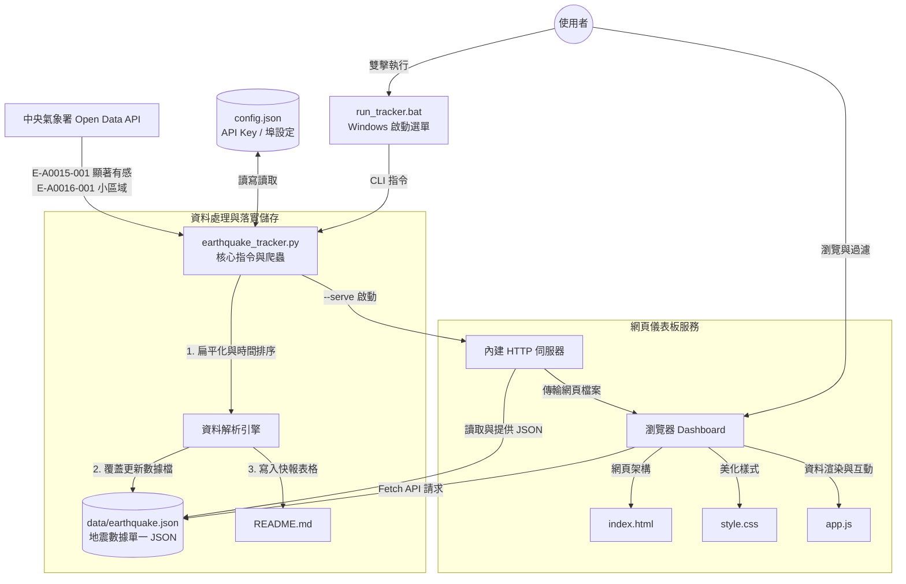

# 台灣地震追蹤器 | 系統架構說明書 (System Architecture)

本專案是一個輕量化、無外部依賴的台灣地震資料抓取與視覺化系統。本文件詳細說明了目前的系統架構、元件關係與資料流向。

---

## 🏗️ 系統架構概覽

本系統採用 **Pipeline 爬蟲存檔** 與 **SPA (Single Page Application) 本地儀表板** 結合的雙層架構，元件間透過 JSON 檔案進行鬆耦合（Loose Coupling）通訊。

### 核心設計原則：
1.  **無外部依賴 (Zero Dependency)**：Python 腳本完全使用內建的 `urllib` 與 `http.server`，不需安裝第三方套件（如 `requests` 或 `flask`），開箱即用。
2.  **單一檔案歷史控管 (Single-File History)**：抓取資料時合併「顯著有感」與「小區域」地震，僅輸出為單一檔案 `data/earthquake.json`。透過 Git 進行檔案的版本變更管理，保持工作目錄的極度簡潔。
3.  **防衝突埠設計 (Resilient Port Binding)**：本地伺服器內建自動埠掃描，當 Port 8800 被佔用時，自動尋找下一個可用 Port，避免服務無法啟動。

---

## 📊 系統資料流與元件互動 (Data Flow)

以下是資料從氣象署 API 延伸到使用者瀏覽器的互動圖：



---

## 🧩 核心元件說明 (Component Breakdown)

| 元件名稱 | 檔案路徑 | 職責與描述 |
| :--- | :--- | :--- |
| **主控制台** | `earthquake_tracker.py` | 負責處理命令列參數（`--fetch`, `--serve` 等）、讀取 `config.json`，並實作爬蟲抓取、資料流寫入以及 HTTP Server。 |
| **設定中心** | `config.json` | 儲存 API 授權碼、抓取的地震資料集清單、輸出路徑與預設埠號。若檔案不存在，主控制台會自動模板化建立。 |
| **啟動器** | `run_tracker.bat` | 提供 Windows 使用者簡易的互動式 DOS 選單，可雙擊執行，無須記住 Python 命令列指令。 |
| **數據檔 (唯一)** | `data/earthquake.json` | 爬蟲將深層嵌套的氣象局原始資料，扁平化萃取為只包含 `ID, 時間, 地點, 規模, 深度, 震度列表, 最大震度` 的極簡 JSON。前端會讀取此檔，同時此檔可上傳 Git 追蹤歷史提交。 |
| **儀表板視圖** | `index.html` | 單頁應用 (SPA) 結構，預留搜尋欄、震級過濾 Tab、地震清單、詳細資訊卡片、最大震度列表與分布圖。 |
| **視覺特效** | `style.css` | 採用暗色系（Dark Theme）毛玻璃設計，運用 CSS 漸變、陰影、自訂滾動條與微動畫，建立高級視覺感受。 |
| **交互控制** | `app.js` | 動態拉取 JSON，根據地區清單進行分類過濾，將震級與最大震度轉譯並渲染為精美的 UI 卡片，且支援分布圖的載入與錯誤退回占位符機制。 |

---

## 💾 資料儲存結構

當系統執行 `--fetch` 後，資料將按以下層級妥善保管：

```text
scrape-taiwan-earthquakes/
├── data/
│   └── earthquake.json                    # 最新的精簡地震數據檔案（唯一數據源與 Git 追蹤對象）
```

---

## 🔄 核心運作邏輯 (Execution Flows)

### 1. 爬蟲抓取流程 (Fetch Flow)
1. 讀取 `config.json`，檢查 API Key 是否有效。
2. 發送 HTTPS GET 請求至氣象局 API 抓取 `E-A0015-001` 與 `E-A0016-001`。
3. 呼叫 `parse_earthquakes()` 將取得的資料結構解析為扁平 JSON 項目。
4. 合併兩組資料，並依發震時間（`OriginTime`）由新到舊排序，保留最新的 50 筆紀錄。
5. 覆蓋更新儲存至 `data/earthquake.json`。
6. 分析最新 10 筆地震，並更新 `README.md` 的氣象區塊表格。

### 2. 伺服器啟動流程 (Serve Flow)
1. 讀取 `config.json` 中的 `server_port`（預設 8800）。
2. 嘗試建立 `TCPServer` 綁定埠號。
3. 若發生 `OSError` 且為 `Address already in use`，則自動 `port + 1` 再次嘗試。
4. 重複嘗試最多 20 次，成功後啟動 HTTP 服務。
5. 調用系統預設瀏覽器打開 `http://localhost:{port}/index.html`。
